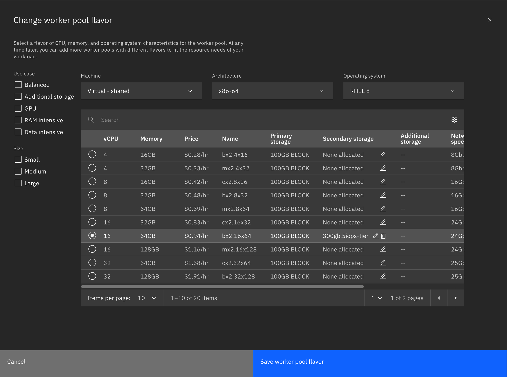
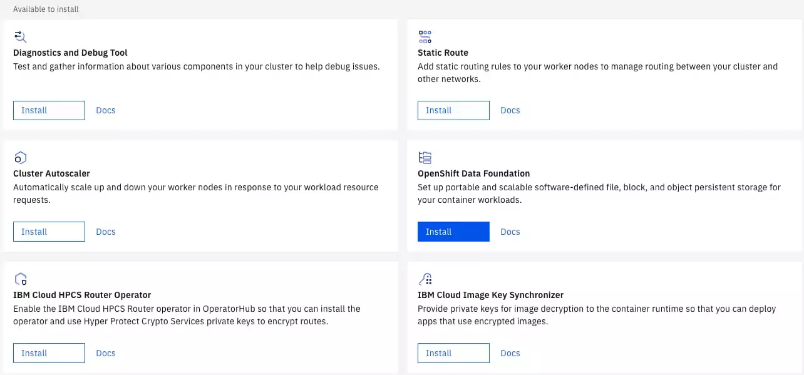
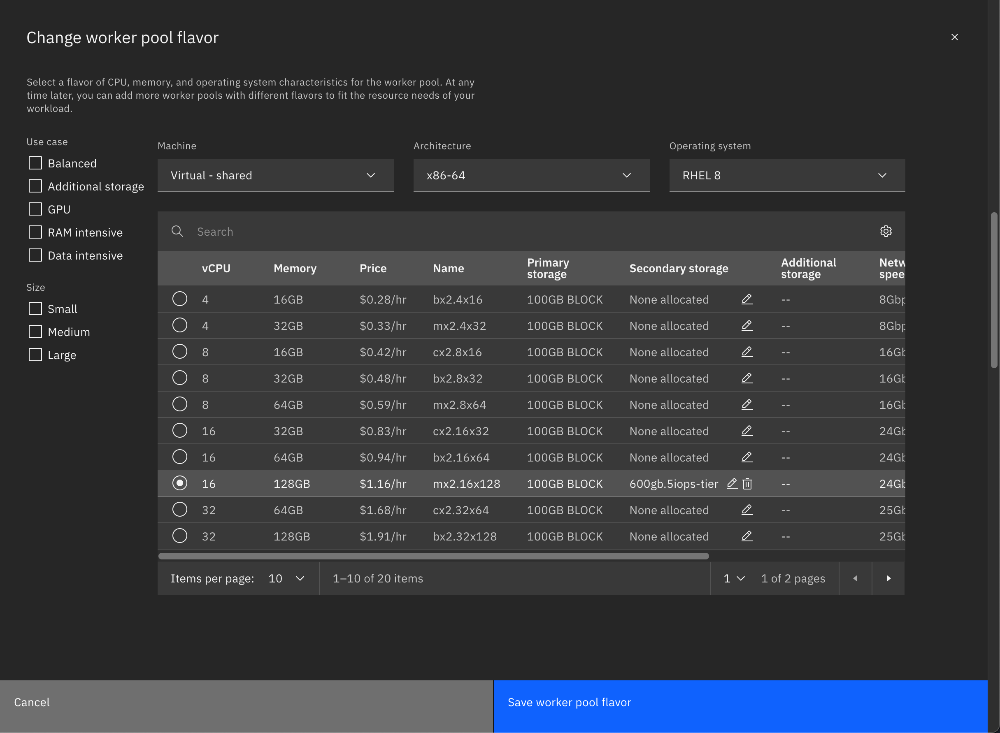

# Provisioning an OpenShift Cluster

**Note:** This tutorial uses a ROKS cluster on IBM Cloud. It requires a VPC with 3 subnets (1 per zone).


## Worker Pool 1 - OpenShift Data Foundation (ODF) Nodes

1. This tutorial uses OpenShift version 4.12.46.
2. For our first worker pool, we'll provision the nodes used by ODF. We'll provision 1 worker node per zone for a total of 3 worker nodes. Each node will have the following specifications: 16 vCPU's, 64 GB RAM, 100GB BLOCK primary storage, 300GB 5iops-tier secondary storage. The described worker pool flavor can be found below:
 


## Install ODF onto Worker Pool 1

Once Worker Pool 1 has been provisioned and the nodes are healthy, we can install ODF. 

1. Click on your cluster in the resource list and scroll down. At the bottom of your cluster overview screen, you will see an option to install OpenShift Data Foundation:

2. For our ODF configuration, select the following values:
   1. Version: 4.12
   2. Plan: Advanced
   3. Storage Type: Remote Provisioning
   4. OSD Storage Class Name: the default
   5. OSD pod size (Gi): 2000
   6. Number of OSD Disks Required: 1
   7. Worker Nodes: Enter your 3 worker node IP's separated by commas
      1. For example: 10.240.0.32, 10.242.0.33, 10.242.0.34
   8. Check the box for "Deploy NooBaa multicloud gateway"
   9. Click Install


## Apply taints to Worker Pool 1 - ODF Nodes

To avoid CPD's pods being placed into the ODF worker pool, we can apply taints to our existing 3 ODF nodes in worker pool 1

1. Login to your cluster using the oc cli on your Linux VM
2. You can run `oc get nodes` to see the names of the three nodes we need to taint
3. Run the following command for EACH node (you will have to run this command a total of three times, once per node):
   ```
   oc adm taint nodes <YOUR_NODE_NAME> node.ocs.openshift.io storage="true":NoSchedule
   ```
4. You can check that the taint has been applied by running the following command for each node and scrolling to the "Taints" section in the output:
   ```
   oc describe node <YOUR_NODE_NAME>
   ```

## Apply your IBM Entitlement Key to your cluster's global pull secret

We need to download the cpd-cli to apply our entitlement key before our second worker pool, which is used for the cpd install, is provisioned. Ensure that your podman machine is running on your VM before starting the following steps.

   
1. Make a directory on your Linux VM and change directories into it:
   ```
   mkdir cpd
   cd cpd
   ```
2. Install CPD-CLI on your Linux VM:
   ```
   curl -LSo cpd-cli-linux-EE-13.tgz https://github.com/IBM/cpd-cli/releases/download/v13.1.0/cpd-cli-linux-EE-13.1.0.tgz
   ```
3. Extract the file contents:
   ```
   tar -xf cpd-cli-linux-EE-13.tgz
   ```
4. Change into the newly extracted directory
5. Login to the IBM registry
   ```
   podman login cp.stg.icr.io -u cp -p <IBM_PRIVATE_ENTITLEMENT_KEY>
   ```
6. Spin up the olm-utils container and add the entitlement key to the global pull secret
   ```
   ./cpd-cli manage restart-container

   ./cpd-cli manage login-to-ocp <YOUR_OC_LOGIN_COMMAND>

   ./cpd-cli manage add-cred-to-global-pull-secret --registry=cp.icr.io --registry_pull_user=cp --registry_pull_password=<YOUR_IBM_PUBLIC_ENTITLEMENT_KEY>
   ```


## Provision Worker Pool 2 - CPD Nodes

1. We'll provision 2 worker nodes per zone for a total of 6 worker nodes. Each node will have the following specifications: 16 vCPU's, 128 GB RAM, 100GB BLOCK primary storage, 600GB 5iops-tier secondary storage. The described worker pool flavor can be found below:




